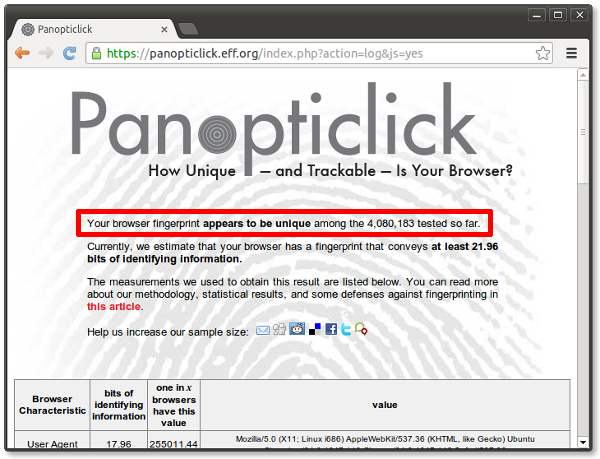

# Chameleon

[Browser fingerprinting](http://akademie.dw.de/digitalsafety/your-browsers-fingerprints-and-how-to-reduce-them/) protection for everybody.

Chameleon is a Chrome privacy extension that :star2: detects fingerprinting-like activity, and :sparkles: protects against fingerprinting, currently by making Chrome look like Tor Browser.

## :warning: WARNING :warning:

Chameleon is pre-alpha, developer-only software.

Please note that while Chameleon detects the use of [canvas fingerprinting](http://www.propublica.org/article/meet-the-online-tracking-device-that-is-virtually-impossible-to-block), Chameleon does not yet protect against it. See the [coverage table](#coverage) below for more on Chameleon's current status.

The next step for Chameleon is to block scripts from loading based on their use of fingerprinting techniques, of which canvas fingerprinting is one. This work is in progress now (enabled by tying code execution to originating scripts in [25d7a5](https://github.com/ghostwords/chameleon/commit/25d7a5971347902bac594d669de388416b1f21ca)).

### Detection

Chameleon detects [font enumeration](http://www.lalit.org/lab/javascript-css-font-detect/) and intercepts accesses of fingerprinting-associated JavaScript objects like [Window.navigator](https://developer.mozilla.org/en-US/docs/Web/API/Navigator).

The number over Chameleon's button counts the number of distinct attempts to collect information about your browser on the current page. Higher numbers suggest fingerprinting might be taking place.

### Protection

Since [Tor users are supposed to all look alike](https://www.torproject.org/projects/torbrowser/design/#fingerprinting-linkability), Chameleon attempts to blend in by altering request headers and JavaScript properties to match Tor Browser's values.

To start with, Chameleon covers [Panopticlick](https://panopticlick.eff.org/)'s fingerprinting set, with more complete coverage in the works.

Chrome without Chameleon:

Chrome with Chameleon:

Tor Browser:

## Installation

To manually load Chameleon in Chrome, check out (or [download](https://github.com/ghostwords/chameleon/archive/master.zip) and unzip) this repository, go to `chrome://extensions/` in Chrome, make sure the "Developer mode" checkbox is checked, click on "Load unpacked extension..." and select the [chrome](chrome/) folder inside your Chameleon folder.

To update manually loaded Chameleon, update your checkout, visit `chrome://extensions` and click on the "Reload" link right under Chameleon's entry.

You could also generate an installable CRX package. See below for details. To install from a CRX package, drag and drop the package file onto the `chrome://extensions` page.

## Development setup

1. `npm install` to install dev dependencies.
2. `npm run lint` to check JS code for common errors/formatting issues.
3. `npm run watch` to monitor extension sources for changes and regenerate extension JS bundles as needed. Leave this process running in a terminal as you work on the extension. Note that you still have to reload Chameleon in Chrome from the `chrome://extensions` page whenever you update Chameleon's injected script or background page.
4. `npm run dist` to generate an installable CRX package. This requires having the signing key in `~/.ssh/chameleon.pem`. To get a key, visit `chrome://extensions/` in Chrome and click on the "Pack extension..." button to generate a CRX manually.

CSS sprites were generated with [ZeroSprites](http://zerosprites.com/).

## Coverage

Fingerprinting technique | Detection | Protection | Notes
------------------------ |:---------:|:----------:| -----
Request header values | ✗ | ✔ | detection of passive fingerprinting requires an indirect approach
window.navigator values | ✔ | ✔ | partial protection (navigator.javaEnabled not yet overriden, ...)
window.screen values | ✔ | ✔
Date/time queries | ✔ | ✔ | partial protection (need to adjust the entire timezone, not just getTimezoneOffset)
Font enumeration | ✔ | ✗ | unable to override fontFamily getters/setters on the CSSStyleDeclaration prototype in Chrome; needs more investigation
CSS media queries | ✗ | ✗ | needs investigation
Canvas image data extraction | ✔ | ✗ | protection impeded by image rendering differences between Chrome and Firefox
Request header ordering/checksum, window.navigator checksum, checksumming in general | ? | ? | needs investigation
Flash/Java-driven queries | ✗ | ✗ | plugins need to be switched to click-to-play by default
Third-party cookies | ✗ | ✗ | need to disable by default
JS/rendering engine differences | ✗ | ✗ | needs investigation
Packet inspection/clock skew (?) | ✗ | ✗ | not possible in a browser extension

## Code license

Mozilla Public License Version 2.0
